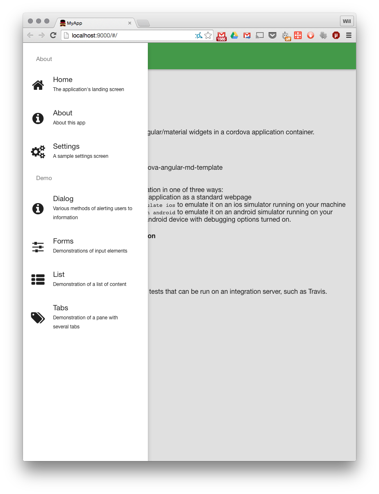
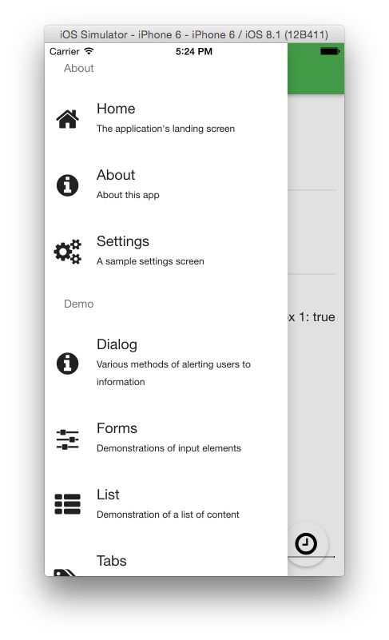
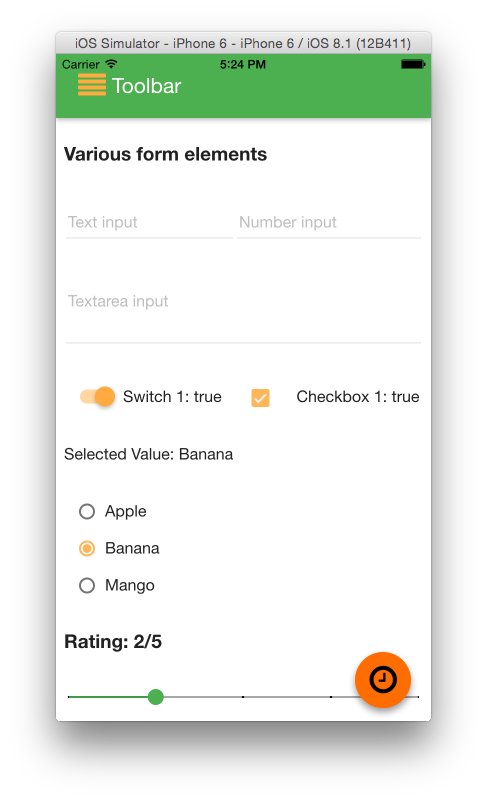
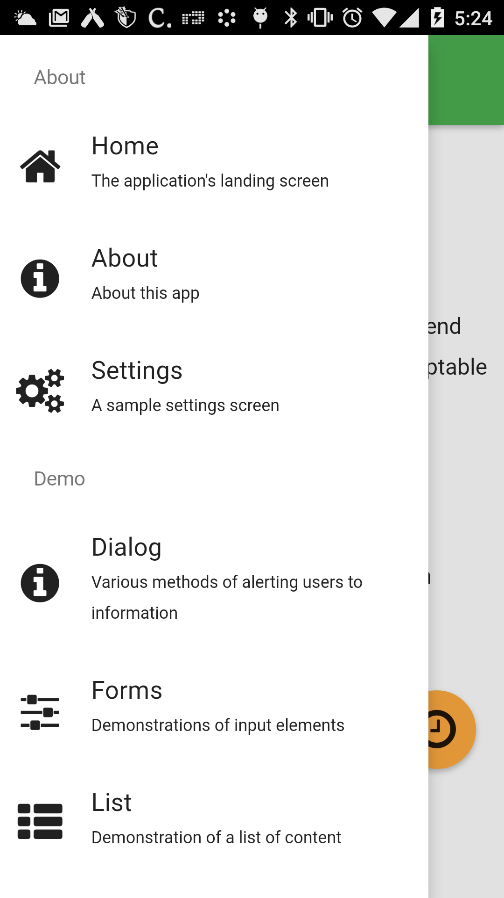

YO ANGULAR CORDOVA
=================

Follow the commit history of this project to learn how to build a yeoman angular cordova app.

Sample screenshots
------------------

### Grunt

### iPhone

### Android

Dependencies
------------

You may need to run some of the following to get all the dependencies for this application

   * npm install -g grunt-cli
   * npm install -g bower
   * npm install -g cordova
   
For ios development you will need the following
   
   * npm install -g ios-deploy
   * npm install -g ios-sim

For android development you will need

   * brew install android
   * android 
       * download packages and set up an android device for emulation

To build a cordova app
---------------------

1. npm install
2. grunt 

To run on android
-----------------

     grunt cordovacli:runAndroid

To emulate on ios
-----------------

     grunt cordovacli:emulateIos

To run on ios
-------------

     grunt cordovacli:runIos

How to use this repository
--------------------------

This repo is meant to demo material design application patterns on a mobile device and a browser.  You can also build
an application of your own using this repository as the backbone.  One suggested workflow for this would be:

1. Fork this repository
    - alternately, duplicate this repository and add this repo as an upstream ref
2. Modify the section of Gruntfile.js that looks like this:

         var customConfig = {
           // The following variables can be customized for an application that forks this repo
           appName: 'YoAngularCordova',
           appPackage: 'com.sample.YoAngularCordova',
           plugins: [
             'https://github.com/j-mcnally/cordova-statusTap',
             'org.apache.cordova.statusbar'
           ],
           platforms: ['ios', 'android'],
           statusBarBackgroundColor: '#388E3C' // Should be the 700 color for your main color http://www.google.com/design/spec/style/color.html#color-color-palette
         };

    Specifically, it is important to have a unique appPackage and recommended to have a unique appName.  You will also
    want to replace any references to application name in package.json and bower.json with your application's name.
    
3. Modify the application scaffolding in app/views/sidenav.html, app/scripts/app.js, and the relevant controllers.  You
may have to add/remove tests as necessary.  

4. Periodically, you will want to pull any changes made from the upstream repository into your application.  [Here](https://stackoverflow.com/questions/3903817/pull-new-updates-from-original-github-repository-into-forked-github-repository/3903835#3903835) 
is a detailed guide on various ways to do that.  I'd recommend using:

        git rebase upstream/master
        
    to replay your application's changes onto the template.
    
5. If you make any core functionality changes or improvements to the app that you believe others would benefit from, 
I recommend forking the repo and making a pull request into the original so that others may benefit from it.

Directory Structure
-------------------

* /app - 
    * /scripts
        * app.js - contains the basic angular application, angular modules loaded, routing information, theme and 
        configuration
        * rootScope.js - contains any functions or variables bound to rootScope (in general this should be avoided and 
        these should be isolated to services
        * /controllers
            * global.js - contains the controller for the global application, controlling behavior that is shared across 
            application panes (i.e. search, sidenav, toasts)
            * main.js - contains the controller for the main landing page
            * about.js - contains the controller for the about page
        * /directives
            * scrolltotoponnavclick.js - contains a directive for instructing a scrollable html container to scroll
            to top when a "NavClicked" event is emitted on rootScope
    * /styles - contains css (this will all be merged and minified when you build the app)
    * /views - contains all the application panes and module html
    * /images - contains any images used in the application itself
* /docs - contains any images or extra data needed for the README documentation
* /test - contains karma tests for your angular application
* package.json - contains the node dependencies
* .bower.json - contains the bower dependencies
* Gruntfile.js - contains the build process for this application

Modifications
-------------

Additions to the app can be made with the standard [yeoman generator-angular](https://github.com/yeoman/generator-angular)
commands.  For example, a new route, tab, and controller can be added with the command <code>yo angular:route myroute</code>

Generated files not in git
--------------------------

* node_modules - node modules - these are generated by npm install
* bower_components - bower dependencies - these are generated by grunt
* dist - the generated application
* cordova - the generated cordova mobile applications for ios and android
